# Face Reading — 12-block architecture (two-pass AI)

Implemented in `vedic/face_reading/`. Default ON via env.

## 1. Files (new / changed)

| File | Role |
|------|------|
| `face_report_blocks.py` | 12 `REPORT_BLOCKS`, `LEGACY_SOURCES`, `build_ordered_blocks()`, Pass A/B keys |
| `face_ai_orchestrator.py` | Pass A (mini) + Pass B (4o), `enrich_12_blocks()`, insights Redis cache |
| `narrator.py` | `assemble_report()` → 12 blocks + orchestrator when `FACE_AI_TWO_PASS=1` |
| `pdf_report.py` | `_render_12_block_pdf()` narrative-first PDF |
| `face_signal_bundle.py` | `block_*` in `SECTION_GOALS` / `SECTION_FOCUS_KEYS` |
| `ai_narrator.py` | Legacy 21-section path; cache version `face-v7-12block-2pass` |
| `flask_app.py` | `report_layout_meta()` in analyze/dedup JSON |

## 2. Refactor plan (done)

1. **Analyze** — unchanged: 9 engines, 22 legacy `section_*` keys + `signal_bundle` in Redis (`face:analysis:{id}`).
2. **Narrator** — map legacy → 12 blocks (`LEGACY_SOURCES`); no duplicate engine runs.
3. **AI** — one Pass A call (all 12 insights) + one Pass B call (8 premium blocks + hook/tldr).
4. **PDF** — linear 12 narrative pages + appendix (scores, feature table).
5. **Rollback** — `FACE_REPORT_LAYOUT=21` + `FACE_AI_TWO_PASS=0` restores 21-section + selective `ai_narrator`.

## 3. Updated AI flow

```
FaceSignalBundle (from engines + legacy sections, cached on analysis)
    │
    ├─ Pass A [gpt-4.1-mini]  ONE json_object call
    │     → 12 × {one_liner, bullets, observation, implication, anchor_phrase}
    │     → cache: face:insights:{analysis_id}:{lang}
    │
    ├─ Apply Pass A prose to ALL blocks (no extra LLM)
    │
    └─ Pass B [gpt-4o]  ONE json_object call
          → block_01, 03, 06, 07, 09, 12 + faceread.hook_* + faceread.tldr
          → fact-guard + voice validation; else keep Pass A text
```

## 4. Updated narrator flow

```
assemble_report(sections, engines, …)
  → use_12_block_layout() ?
       YES: build_ordered_blocks() + appendix_sections()
       NO:  legacy SECTION_TITLES + write_narrative × 21
  → build_hook / build_tldr / build_final_truth_v2
  → enrich:
       12 + FACE_AI_TWO_PASS=1 → enrich_12_blocks()
       else + ai_enabled       → enrich_face_narratives() [legacy]
  → report_template_version: 12_block_v1 | 21_section_v1
```

## 5. Model routing logic

| Stage | Env | Default model | When |
|-------|-----|---------------|------|
| Pass A | `FACE_READING_PASS_A_MODEL` | `gpt-4.1-mini` | `FACE_AI_TWO_PASS=1`, bundle → insights JSON |
| Pass B | `FACE_READING_AI_MODEL` | `gpt-4o` | Subset `PASS_B_BLOCKS` only |
| Legacy | `FACE_READING_AI_MODEL` | `gpt-4o` | `FACE_REPORT_LAYOUT=21` or two-pass off |
| Off | `FACE_READING_AI_NARRATOR=0` | — | Templates only |

Caps: `face_cache.is_daily_token_capped()` skips OpenAI; templates + Pass A cache still apply.

## 6. Token savings (typical PDF, Hinglish)

| Path | OpenAI calls | Rough input tokens | Notes |
|------|--------------|-------------------|--------|
| **Before** (21-section selective) | 1–3× gpt-4o batch | ~18k–35k / PDF | 8–14 section prompts × full bundle slices |
| **After** (12-block 2-pass) | 1× mini + 1× 4o | ~4k mini + ~8k 4o | Bundle sent twice, not 12× |
| **After cache hit** | 0–1 (Pass B only) | ~8k | Pass A in `face:insights:{id}:{lang}` |

Savings driver: **12 narrative slots** (was 21), **2 API calls max** (was up to 3× 4o batches), **no per-section bundle re-serialization** in Pass A.

## 7. Example Pass A JSON

```json
{
  "block_01_screen": {
    "one_liner": "Tumhara chehra pehli nazar mein calm-leader energy deta hai.",
    "bullets": [
      "Aankhon ka spacing depth suggest karta hai — surface se zyada sochte ho.",
      "Jaw line discipline dikhata hai, par smile warmth ko balance karti hai."
    ],
    "observation": "Public read: approachable authority, not loud dominance.",
    "implication": "Meetings me tum listen-first dikhte ho, phir clear verdict.",
    "anchor_phrase": "calm-leader"
  },
  "block_03_emotional_wiring": {
    "one_liner": "Andar feelings tez chalti hain; bahar measured rehna prefer karte ho.",
    "bullets": ["Attachment: repair-oriented", "Stress: withdraw-then-return"],
    "observation": "Mask vs real gap moderate — trusted circle ko zyada dikhta hai.",
    "implication": "Conflict me pehle silence, phir direct honesty.",
    "anchor_phrase": "measured-warmth"
  }
}
```

## 8. Example Pass B prose (one key)

```json
{
  "block_06_love_attachment": "Tum love mein depth ke saath pace bhi chahte ho — jaldi surface-level nahi, par door bhi nahi rehna. Jab partner inconsistent ho, tum pehle observe karte ho, phir ek clear baat se boundary set karte ho. Repair tumhare liye important hai: 'sorry' se zyada consistent action matter karti hai. Intimacy friction tab aati hai jab tum emotional load ko words mein late translate karte ho — partner ko lag sakta hai tum withdraw kar rahe ho, jabki tum process kar rahe ho."
}
```

## 9. Failure fallback strategy

```
Pass A fails     → legacy_template_narrative() per block (narrative_writer)
Pass B fails     → keep Pass A / template text for that block
Pass B invalid   → voice/fact-guard reject → keep Pass A
Token cap        → skip all OpenAI; templates only
Redis insights   → Pass A reused; Pass B still runs unless narration cache hits full report
PDF render error → report_cache.safe_render returns error JSON (unchanged)
```

## 10. Cache flow

```
analyze → face:analysis:{analysis_id}  (engines, sections, signal_bundle)
PDF request
  ├─ face:pdf:{analysis_id}:{lang}     → stream file (no AI)
  ├─ face:narration:{analysis_id}:{lang} → full assembled report (slim)
  └─ miss → assemble_report
              ├─ face:insights:{analysis_id}:{lang}  (Pass A only)
              └─ put_narration after assemble
```

Bump cache namespace: `FACE_CACHE_VERSION=face-v7-12block-2pass` (orchestrator + ai_narrator).

## 11. Before vs after architecture

```mermaid
flowchart TB
  subgraph before [Before - 21 section]
    E1[extract] --> A1[analyze 9 engines]
    A1 --> S1[22 section_* keys]
    S1 --> P1[assemble_report 21 slots]
    P1 --> AI1[selective gpt-4o 1-3 batches]
    AI1 --> PDF1[pdf_report 21-section layout]
  end

  subgraph after [After - 12 block 2-pass]
    E2[extract] --> A2[analyze 9 engines]
    A2 --> S2[22 legacy keys + signal_bundle]
    S2 --> P2[build_ordered_blocks x12]
    P2 --> PA[Pass A mini 1 call]
    PA --> PB[Pass B 4o 1 call]
    PB --> PDF2[pdf_report 12-block layout]
  end
```



## 12. Environment

```bash
FACE_REPORT_LAYOUT=12_v1      # default; use 21 for legacy PDF
FACE_AI_TWO_PASS=1            # default; 0 = legacy ai_narrator on 12 blocks
FACE_READING_PASS_A_MODEL=gpt-4.1-mini
FACE_READING_AI_MODEL=gpt-4o
FACE_READING_AI_NARRATOR=1
REDIS_URL=redis://127.0.0.1:6379/0
```

## 13. Operational checklist

1. Redis up (`docker compose up redis` in api-server).
2. Restart Flask after deploy.
3. New `analysis_id` per face (old narration cache is 21-section shaped).
4. Verify logs: `[face_ai] Pass A OK`, `[face_ai] Pass B OK`, `12-block 2-pass: N API call(s)`.
