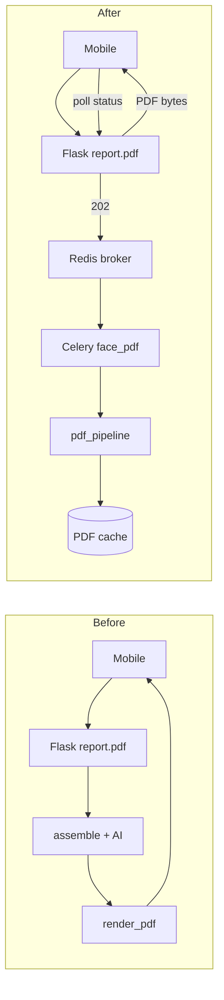

# Face Reading — Celery async PDF pipeline

Moves **assemble + AI + ReportLab render** off the Flask request thread. API returns **202** immediately; worker streams progress via Redis.

## 1. Files

| File | Role |
|------|------|
| `celery_app.py` | Broker/result, queues, task routes |
| `tasks/face_report_tasks.py` | `face.generate_pdf_report` task |
| `vedic/face_reading/pdf_pipeline.py` | Shared sync pipeline (Flask + worker) |
| `vedic/face_reading/progress_events.py` | Redis progress + pub/sub |
| `vedic/face_reading/report_async.py` | Enqueue, status, locks |
| `vedic/face_reading/flask_pdf_handlers.py` | HTTP: PDF, status, SSE, WS |
| `scripts/run_celery_face_worker.sh` | Linux/macOS worker |
| `scripts/run_celery_face_worker.ps1` | Windows worker |

## 2. Celery architecture

```
Flask (Gunicorn)                    Celery worker (face_pdf queue)
     │                                      │
     ├─ GET report.pdf ──202──► apply_async │
     ├─ GET report/status ◄──Redis job──────┤
     ├─ GET report/events (SSE) ◄─pub/sub───┤
     └─ WS  report/ws ◄──────────pub/sub────┤
                                           │
                    run_face_pdf_pipeline()
                    assemble → render → report_cache.save
```

## 3. Queue routing

| Task | Queue | Routing key |
|------|-------|-------------|
| `face.generate_pdf_report` | `face_pdf` | `face_pdf` |
| (default Celery tasks) | `celery` | `celery` |

Env: `CELERY_FACE_PDF_QUEUE=face_pdf`

## 4. Worker startup

```bash
cd artifacts/api-server
pip install -r requirements.txt
docker compose up -d redis
./scripts/run_celery_face_worker.sh
# Windows: .\scripts\run_celery_face_worker.ps1
```

## 5. Redis configuration

| DB | URL suffix | Use |
|----|------------|-----|
| 0 | `/0` | Face cache, sessions, progress (`REDIS_URL`) |
| 1 | `/1` | Celery broker (`CELERY_BROKER_URL`) |
| 2 | `/2` | Celery results (`CELERY_RESULT_BACKEND`) |

Progress keys:

```
face:progress:{session_id}:{lang}
face:progress:ch:{session_id}:{lang}   # pub/sub
face:job:pdf:{session_id}:{lang}
face:lock:pdf:{analysis_id}:{lang}
```

## 6. Docker

```bash
cd artifacts/api-server
docker compose up -d redis celery-face-pdf
```

Flask on host:

```bash
export REDIS_URL=redis://localhost:6379/0
export CELERY_BROKER_URL=redis://localhost:6379/1
export FACE_PDF_ASYNC=1
python flask_app.py
```

## 7. API refactor plan (implemented)

| Endpoint | Behavior |
|----------|----------|
| `GET /api/face_reading/report.pdf` | PDF cache → stream; else async **202** or sync (`?sync=1`) |
| `GET /api/face_reading/report/status` | Job state + progress |
| `GET /api/face_reading/report/events` | SSE progress stream |
| `WS /api/face_reading/report/ws` | WebSocket progress (flask-sock) |

Query flags:

- `sync=1` — force in-request pipeline (no Celery)
- `wait=1` — block up to `FACE_PDF_WAIT_TIMEOUT` (default 120s) then stream PDF

## 8. WebSocket integration

```
ws://host/api/face_reading/report/ws?session_id=...&language=hinglish
```

Sends JSON events: `{status, stage, percent, message, ...}` until `ready` or `failed`.

Requires: `flask-sock`, `simple-websocket`.

## 9. Retry logic

Task `face.generate_pdf_report`:

- `autoretry_for`: `ConnectionError`, `TimeoutError`, `OSError`
- `max_retries`: `FACE_PDF_MAX_RETRIES` (default 3)
- `retry_backoff=True`, jitter on
- `acks_late=True` — re-queue if worker dies mid-render

Non-retry: missing session (`no_report_in_session`).

## 10. Failure recovery

| Failure | Recovery |
|---------|----------|
| Worker crash | Celery redelivers (acks_late); lock TTL expires |
| OpenAI cap | Pipeline uses templates; job still completes |
| Render error | Job `failed`, progress event; client may retry POST pdf |
| Stale lock | `FACE_PDF_JOB_TTL` releases lock; re-enqueue allowed |
| Duplicate click | Stable `task_id=face-pdf-{session}:{lang}` dedupes queue |

## 11. Concurrency control

- Redis `SET NX` lock: `face:lock:pdf:{analysis_id}:{lang}`
- Worker `prefetch_multiplier=1` — one PDF task in flight per worker slot
- `FACE_PDF_WORKER_CONCURRENCY` (default 2) — parallel PDFs per machine

## 12. Progress event system

Stages: `queued` → `cache_check` → `assemble` → `render` → `save` → `ready` | `failed`

```json
{
  "job_id": "abc123:hinglish",
  "status": "processing",
  "stage": "render",
  "percent": 70,
  "message": "Rendering PDF",
  "ts": 1716200000.1
}
```

## 13. Before vs after



## Environment

```bash
FACE_PDF_ASYNC=1
CELERY_ENABLED=1
CELERY_BROKER_URL=redis://localhost:6379/1
CELERY_RESULT_BACKEND=redis://localhost:6379/2
FACE_PDF_WORKER_CONCURRENCY=2
FACE_PDF_POLL_MS=800
FACE_PDF_WAIT_TIMEOUT=120
```

Disable async (local debug): `FACE_PDF_ASYNC=0` or `?sync=1` on PDF URL.
